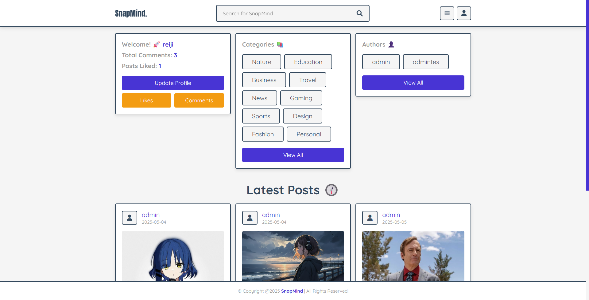
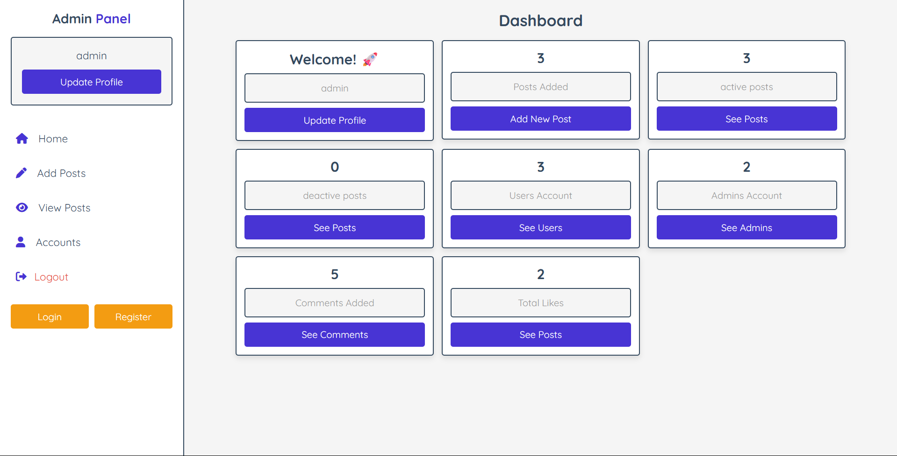

# SnapMind 📸
SnapMind adalah platform berbasis Blog Website yang memungkinkan pengguna untuk membuat postingan, berkomentar, dan menyukai konten favorit mereka dalam berbagai kategori, seperti:

- Teknologi 🧑‍💻
- Musik 🎶
- Gaming 🎮
- Olahraga 🏀
- dan masih banyak lagi.

Dengan antarmuka yang ramah pengguna 🌟, SnapMind menghubungkan komunitas melalui kreativitas dan interaksi! 🚀

## Fitur Utama 🤖
- Postingan Keren 📝: Buat dan kelola postingan dengan kategori seperti Teknologi, Musik, Gaming dan Olahraga.
- Komentar Interaktif 💬: Tambahkan komentar untuk berbagi pendapat dengan komunitas.
- Sistem Like ❤️: Sukai postingan favorit hanya dengan satu klik!
- Manajemen Pengguna 👤: Daftar, login, dan perbarui profil dengan mudah.
- Panel Admin 🛠️: Kelola konten dan pengguna melalui dashboard admin yang aman.
- Desain Responsif 📱: Nikmati pengalaman mulus di desktop dan perangkat mobile.

## Teknologi yang Digunakan ⚙️
- Backend: PHP 8.2 🐘, MariaDB 10.4.32 🗄️
- Frontend: HTML5 🌐, CSS3 🎨, JavaScript ⚡️
- Server: Apache 🖥️

## Tampilan Website ✨
### Home Page - User

___

### Dashboard - Admin
